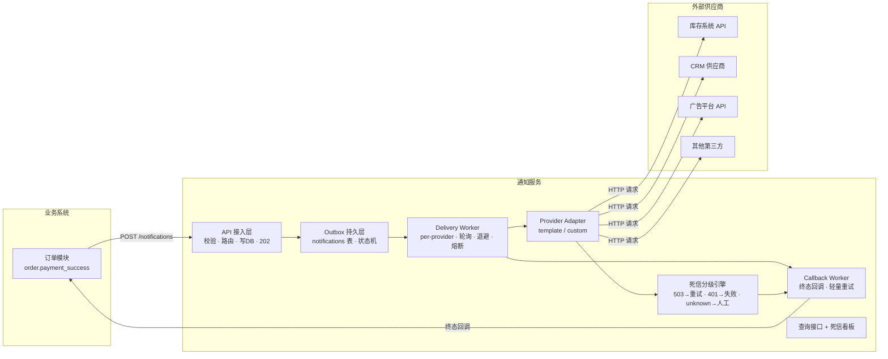
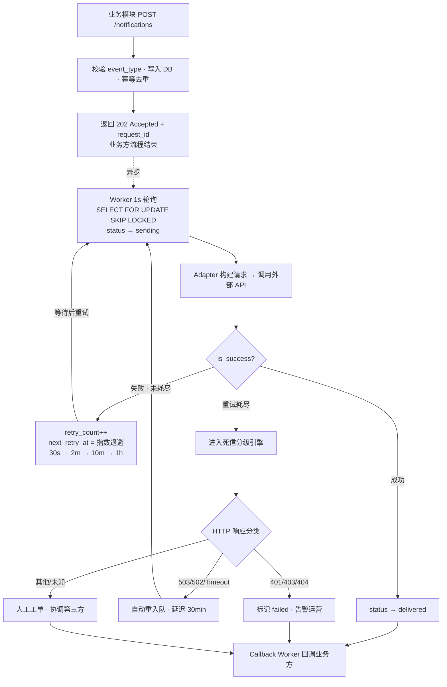
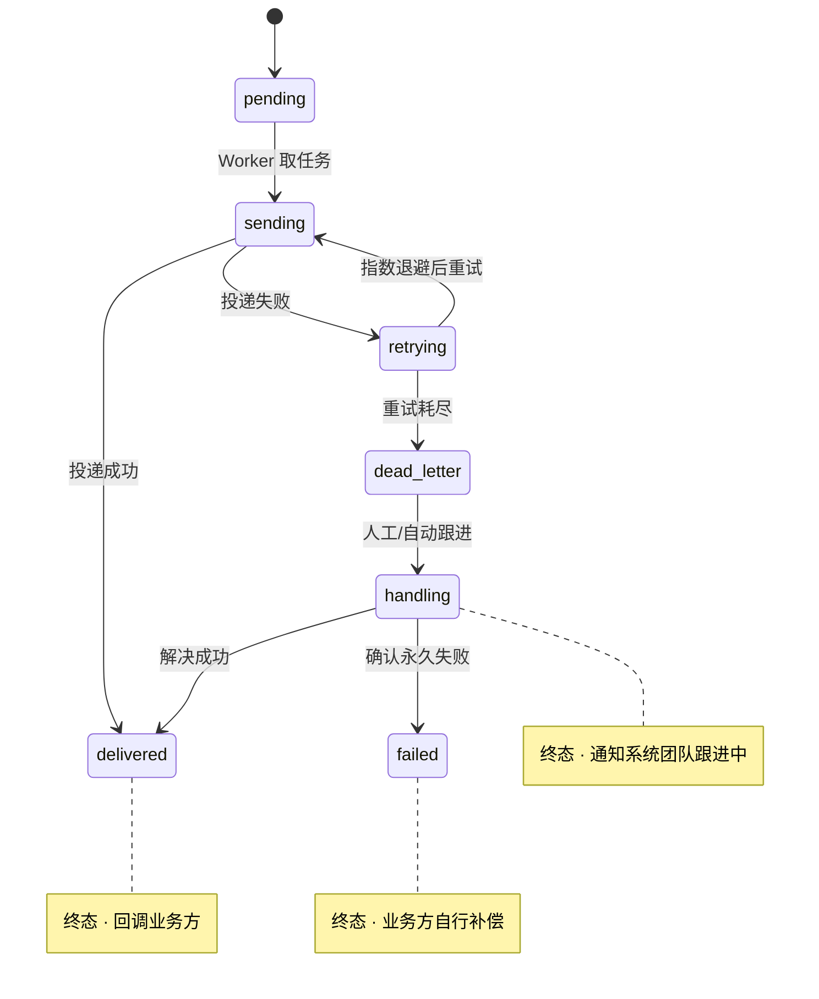
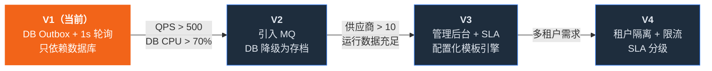

# HTTP 通知系统 — 设计文档

> 接收业务系统各模块提交的外部 HTTP 通知请求，尽可能可靠地投递到目标地址

---

## 1. 设计思路

### 核心问题

企业内部业务系统中，多个业务模块（订单、支付、广告、CRM）在关键事件发生时，需要调用外部供应商的 HTTP API 进行通知。如果每个模块各自实现通知逻辑，将面临重复的重试、监控、异常处理代码，且供应商故障时无统一应对手段。

### 设计原则

1. **对结果负责，不做纯透传中间件。** 投递失败不是甩给业务方的事，通知系统团队负责协调第三方解决。业务方只需发一个 HTTP 请求，后续流程全权托管。

2. **最小依赖，最大确定性。** V1 只依赖一个数据库，不引入 Redis、不引入 MQ。少一个组件就少一种故障模式。DB Outbox + 1s 轮询对日均几千到几万的通知量完全够用。

3. **At-Least-Once 而非 Exactly-Once。** 通知场景丢消息比重复更不可接受。Exactly-Once 在分布式场景下是伪命题——永远无法确定对方是收到了没回还是真没收到。重复可靠幂等键让下游自行去重。

4. **供应商隔离，故障不扩散。** Worker 按 provider 分组，供应商 A 宕机只影响 A 的队列，不波及 B 和 C。熔断机制避免无意义轰击已宕机的服务。

5. **死信智能分级，减少人工介入。** 不是所有失败都需要凌晨叫人。503 自动重入队，401 自动标记失败告警运营，只有真正未知的错误才走人工工单。

6. **演进友好，不为未来过度设计。** 状态机设计好、日志格式规范、Adapter 接口抽象干净——这三件事做对了，后面加 MQ、加供应商、定 SLA 都是平滑演进，不需要重写。

### 关键取舍

| 选择 | 替代方案 | 为什么这样选 |
|---|---|---|
| DB Outbox 轮询 | Kafka / RabbitMQ | V1 流量不需要 MQ，过早引入增加运维成本和故障面 |
| 1s 轮询间隔 | Redis Pub/Sub 信号 | 多一个组件多一种故障模式，1s 延迟完全可接受 |
| 业务方零 SDK | 提供客户端 SDK | 通知系统同步写 DB 已保证不丢，不应把复杂度推给业务方 |
| 不定 V1 SLA | 提前承诺 P99 延迟 | 没有运行数据支撑的 SLA 是拍脑袋，先跑通积累数据再定 |
| SKIP LOCKED | 乐观锁 / 分布式锁 | Worker 并发抢任务冲突率高，SKIP LOCKED 是更精确的工具 |

---

## 2. 系统定位与边界

### 2.1 定位

本系统是一个对投递结果负责到底的内部通知投递服务。投递成功则回调业务方确认，投递失败则由通知系统团队协调第三方解决，业务方无需编写任何补偿逻辑。

### 2.2 系统边界

**解决的问题：**

- 统一接收各业务模块的通知请求（统一入口）
- 适配不同外部供应商的 HTTP 格式差异（Adapter 层）
- 重试、持久化、投递状态追踪、终态回调
- 死信管理与人工跟进流程

**明确不解决的问题：**

- 不做严格顺序保证 — 通知是尽力送达场景，顺序会引入不必要复杂度
- 不做鉴权/限流 — 内部服务，V1 信任调用方，后续可加
- 不做业务回滚 — 投递失败后的业务补偿由业务方自行决定
- 不做 SLA 承诺 — V1 先跑通核心链路，积累运行数据后再定义 SLA

### 2.3 投递语义

**选择：At-Least-Once + 幂等键。**

通知场景丢消息比重复更不可接受。重复可靠幂等键（requestId）让下游自行去重。Exactly-Once 在分布式场景下是伪命题 — 永远无法确定对方是收到了没回还是真没收到。

---

## 3. 系统架构

### 3.1 整体分层

| 层 | 组件 | 职责 |
|---|---|---|
| 接入层 | API Gateway | 参数校验 · 同步写 DB · 返回 202 Accepted |
| 持久层 | Outbox (notifications 表) | 状态机 · 事务写入 · SELECT FOR UPDATE SKIP LOCKED |
| 调度层 | Delivery Worker | per-provider 隔离 · 1s 轮询 · 指数退避 · 熔断 |
| 适配层 | Provider Adapter | template \| custom 路由 · build_request · is_success · extract_error |
| 死信层 | Dead Letter Engine | 自动分级：503 重入队 / 401 标记失败 / unknown 人工工单 |
| 回调层 | Callback Worker | 独立回调通道 · 终态通知业务方 · 轻量重试 2 次 |
| 可观测层 | Monitor + 查询接口 | GET /notifications/{id}/status · 死信看板 · 批量重发 |

**V1 只依赖一个数据库，无 Redis、无 MQ。** Worker 每 1s 轮询 DB，对于日均几千到几万的通知量完全够用。

### 3.2 架构总览



### 3.3 投递流程



### 3.4 状态机



---

## 4. 通讯协议

### 4.1 请求协议（业务方 → 通知系统）

业务方只需做一件事：发一个 HTTP 请求。调用成功（202）后，所有后续流程由通知系统全权负责。

**协议约定：** 你调成功了，后面的事全是我的。你调失败了，重试一次即可，还失败就告警（通知系统本身不可用）。业务方不需要 Outbox 表，不需要 SDK，不需要 Worker。

```
POST /notifications
Content-Type: application/json

{
  "event_type":    "order.payment_success",       // 必填，事件类型，决定路由到哪个 provider
  "biz_id":        "order_20260410_001",           // 必填，业务唯一ID，用于幂等去重
  "payload":       { ... },                        // 必填，业务数据，透传给 Adapter 构建请求
  "callback_url":  "http://order-svc/callback",    // 可选，不传则不回调
  "priority":      0                               // 可选，默认0，数字越大越优先
}

→ 202 Accepted
{ "request_id": "req_abc123" }
```

### 4.2 事件类型注册表（event_type → provider 映射）

业务方与通知系统约定事件类型，通知系统据此路由到对应供应商和 Adapter。新增事件需双方协商后在配置中心注册。

| event_type | 业务模块 | 目标 provider | 说明 |
|---|---|---|---|
| `order.payment_success` | 订单模块 | inventory_system | 支付成功 → 通知库存扣减 |
| `payment.subscription_paid` | 支付模块 | crm_vendor | 订阅付款 → 通知 CRM 更新状态 |
| `ad.user_registered` | 广告模块 | ad_platform | 用户注册 → 通知广告平台归因 |
| `crm.contact_updated` | CRM 模块 | crm_vendor | 联系人变更 → 同步到外部 CRM |

命名规范：`{业务域}.{动作_过去式}`，使用小写 + 下划线 + 点号分隔。业务方不需要知道目标 provider 是谁，只需要发送正确的 event_type。

```yaml
event_registry:
  order.payment_success:
    provider: inventory_system
    adapter_type: template
    description: "支付成功通知库存扣减"
    owner: 订单模块                    # 业务方负责人
    max_retries: 5                     # 可按事件类型覆盖默认值

  ad.user_registered:
    provider: ad_platform
    adapter_type: custom
    adapter_class: AdPlatformAdapter
    description: "用户注册通知广告归因"
    owner: 广告模块
```

### 4.3 回调协议（通知系统 → 业务方）

只在**终态**回调，中间重试状态不回调（业务方可通过查询接口查看中间状态）。回调由独立的 Callback Worker 执行，与投递 Worker 互不阻塞。

| 状态 | 含义 | 业务方动作 |
|---|---|---|
| `delivered` | 外部 API 确认接收，投递成功 | 无需操作 |
| `handling` | 重试耗尽进入死信，通知系统团队跟进中 | 等待即可 |
| `failed` | 确认第三方永久性故障，无法投递 | 业务方自行决定是否补偿 |

```
POST {callback_url}
Content-Type: application/json
X-Notify-Signature: hmac-sha256(body, secret)

{
  "request_id": "req_abc123",
  "event_type": "order.payment_success",
  "biz_id": "order_20260410_001",
  "status": "delivered" | "handling" | "failed",
  "provider": "inventory_system",
  "attempts": 3,
  "finished_at": "2026-04-10T15:30:00Z",
  "error": null | "连续5次超时，最后一次: 504 Gateway Timeout"
}
```

业务方返回 200 → 回调成功。其他 → 通知系统重试 2 次后放弃记日志。回调是"尽力通知"，不是"保证送达"。

### 4.4 责任划分

- **通知系统承诺：** 在重试窗口内尽力投递，最终状态一定会通知业务方。投递失败后由通知系统团队协调第三方解决。
- **业务方承诺：** 收到 failed 后自行决定补偿策略。通知系统不负责业务回滚。

---

## 5. 数据模型

```sql
CREATE TABLE notifications (
    id              BIGSERIAL PRIMARY KEY,
    request_id      VARCHAR(64) UNIQUE NOT NULL,   -- 系统生成，全局唯一
    event_type      VARCHAR(128) NOT NULL,          -- 事件类型，路由依据
    biz_id          VARCHAR(128) NOT NULL,          -- 业务唯一ID，幂等去重
    provider        VARCHAR(64) NOT NULL,           -- 由 event_type 映射而来
    payload         JSONB NOT NULL,
    callback_url    VARCHAR(512),
    status          VARCHAR(20) NOT NULL DEFAULT 'pending',
        -- pending → sending → delivered
        --                   → retrying → dead_letter → handling → delivered / failed
    priority        INT DEFAULT 0,
    retry_count     INT DEFAULT 0,
    max_retries     INT DEFAULT 5,
    next_retry_at   TIMESTAMP,
    last_error      TEXT,
    created_at      TIMESTAMP DEFAULT NOW(),
    updated_at      TIMESTAMP DEFAULT NOW(),
    UNIQUE(event_type, biz_id)                      -- 同一事件+业务ID幂等
);

CREATE INDEX idx_pending ON notifications (provider, status, next_retry_at)
    WHERE status IN ('pending', 'retrying');
```

---

## 6. 核心机制

### 6.1 并发控制：SELECT ... FOR UPDATE SKIP LOCKED

多个 Worker 实例同时轮询 status=pending，会重复消费同一条消息。

```sql
BEGIN;
SELECT * FROM notifications
WHERE status = 'pending'
  AND next_retry_at <= NOW()
  AND provider = 'ad_system'
ORDER BY priority DESC, created_at ASC
LIMIT 10
FOR UPDATE SKIP LOCKED;

-- 被其他 Worker 锁住的行直接跳过，不阻塞，天然分流
UPDATE notifications SET status = 'sending' WHERE id IN (...);
COMMIT;
```

为什么不用乐观锁：乐观锁适合冲突少的场景，Worker 并发抢任务冲突率高，SKIP LOCKED 是更精确的工具。要求 PostgreSQL 9.5+ 或 MySQL 8.0+。

### 6.2 供应商隔离与熔断

Worker 按 provider 分组，每组独立并发上限。供应商 A 宕机时，A 的重试消息只堆积在 A 的 Worker 队列中，不影响 B 和 C 的投递。

```mermaid
graph LR
    subgraph worker-group-ad
        W1[Worker] -->|provider=ad_platform| P1[广告平台 API]
    end
    subgraph worker-group-crm
        W2[Worker] -->|provider=crm_vendor| P2[CRM 供应商]
    end
    subgraph worker-group-inv
        W3[Worker] -->|provider=inventory_system| P3[库存系统 API]
    end

    style worker-group-ad fill:#1a1a2e,stroke:#ef4444,stroke-dasharray: 5 5
    style worker-group-crm fill:#1a1a2e,stroke:#22c55e
    style worker-group-inv fill:#1a1a2e,stroke:#22c55e
```



> A 挂了只影响 `worker-group-ad`（红色虚线），B、C 正常投递不受影响。

**熔断策略：** 同一 provider 连续失败 10 次 → 该 provider 暂停投递 5 分钟 → 告警通知人工。避免无意义轰击已宕机的服务。

### 6.3 重试策略（指数退避）

| 次数 | 间隔 | 累计耗时 |
|---|---|---|
| 第 1 次 | 30 秒 | 30s |
| 第 2 次 | 2 分钟 | ~2.5min |
| 第 3 次 | 10 分钟 | ~12.5min |
| 第 4 次 | 1 小时 | ~72.5min |
| 第 5 次 | 放弃 | 进入死信 |

为什么不固定间隔：外部系统宕机时固定间隔会持续轰击，加重对方负担。为什么不无限重试：一条永远失败的消息会无限占用资源。5 次覆盖约 1 小时，足以应对大多数临时故障。

### 6.4 死信自动分级

重试耗尽后不直接进人工，先自动分级，大幅减少凌晨告警量：

| HTTP 响应 | 分类 | 处理动作 |
|---|---|---|
| 503 / 502 / Timeout | retryable | 自动重新入队，延迟 30 分钟再试一轮 |
| 401 / 403 | auth_error | 标记 failed · 告警运营更新密钥 · 修复后批量重发 |
| 404 | permanent_failure | 直接标记 failed · 回调业务方 |
| 其他 / 响应体异常 | unknown | 创建人工工单 · 协调第三方排查 |

只有 unknown 类型真正需要人工介入，量最小。

---

## 7. 供应商适配

### 7.1 路由规则

Provider 配置中通过 `adapter_type` 字段显式声明走哪条路径：

| adapter_type | 适用场景 | 示例 |
|---|---|---|
| `template` | 纯模板变量填充，无复杂逻辑 | 简单 POST + Header + JSON Body |
| `custom` | 涉及签名计算、OAuth 换 token、自定义响应解析 | 需要 HMAC 签名的 API |

```yaml
providers:
  ad_system:
    adapter_type: template
    url: "https://ad.example.com/callback"
    method: POST
    headers: { "X-Api-Key": "{{secret}}" }
    body_template: '{"event":"{{event}}","userId":"{{userId}}"}'

  crm_vendor:
    adapter_type: custom
    adapter_class: "CRMAdapter"
```

Registry 据此路由：template → `TemplateAdapter(config)`，custom → `adapter_registry[config.adapter_class]()`。新供应商接入时看到 adapter_type 字段即知走哪条路。

### 7.2 Adapter 接口

```python
class NotificationAdapter(ABC):
    def build_request(self, payload) -> HttpRequest
    def is_success(self, response) -> bool       # 各供应商自定义成功判定
    def extract_error(self, response) -> str      # 提取错误信息用于日志和死信分级
```

`is_success` 的关键价值：有些供应商 HTTP 200 但 body 返回 `{"code":"FAIL"}`，通用 HTTP 状态码判断不够，需要供应商级别的响应解析。

---

## 8. 可观测性

### 8.1 查询接口

```
GET /notifications/{request_id}/status

{
  "request_id": "req_abc123",
  "status": "sending",
  "provider": "ad_system",
  "created_at": "...",
  "attempts": [
    { "at": "...", "result": "timeout" },
    { "at": "...", "result": "503" }
  ],
  "next_retry_at": "...",
  "callback_url": "..."
}
```

### 8.2 管理后台

- 按 request_id 搜索、按 provider 筛选、按状态过滤
- 死信看板：按供应商分组，一眼看到哪个供应商集中出问题
- 批量重发：供应商恢复后一键重发该供应商所有死信
- 自动升级：死信超过 30 分钟没人处理 → 升级告警到负责人

### 8.3 关键指标（结构化日志，V1 用 SQL 统计即可）

- 投递成功率（整体 / per-provider）
- 投递延迟（P50 / P99）
- 重试分布（各次重试的成功率）
- 死信率（整体 / per-provider）
- 熔断触发次数

---

## 9. 演进路径

### 9.1 迁移触发条件（量化）

| 指标 | 阈值 | 动作 |
|---|---|---|
| pending 积压 | > 10,000 条 | 检查是否某供应商集中故障 |
| 轮询 P99 延迟 | > 3s | 加 Worker 实例 |
| notifications 表行数 | > 500 万行 | 归档历史数据 |
| 入口 QPS | 持续 > 500/s | 启动 MQ 迁移 |
| DB CPU | > 70% 持续 15min | 立即扩容或迁移 |

### 9.2 版本演进



---

## 10. AI 辅助设计说明

### AI 是思维的放大器

本项目的系统设计过程中，AI 全程深度参与，扮演了 **虚拟 CTO** 的角色。这不是让 AI 替代思考，而是用 AI **放大设计者的思维能力**——你提出一个粗略想法，AI 帮你推演到极端场景、补全你没想到的边界、用行业经验挑战你的假设。

### AI 在本项目中的具体作用

本项目中 AI 扮演了 **虚拟 CTO** 的角色——在架构选型、技术取舍、边界划定等关键节点上，提出方案、挑战假设、推演极端场景。设计者带着初步想法进入讨论，AI 负责从更多维度审视和论证，最终决策权始终在设计者手中。

### 如何与 AI 协作做系统设计

**核心方法：辩证式对话。** 不是让 AI 给一个方案然后照搬，而是：

1. **你先有立场** — 带着自己的初步想法进入讨论，哪怕是错的
2. **让 AI 挑战你** — "这个方案的最大风险是什么？""什么场景下会崩？"
3. **反过来挑战 AI** — AI 建议加 Kafka？追问"V1 真的需要吗？不加会死吗？"
4. **记录取舍理由** — 每个决策的"为什么不"和"为什么是"同样重要
5. **让 AI 扮演不同角色** — 同一个问题，让它分别从 CTO、SRE、业务方的视角审视

### 一个真实的例子

> **设计者：** 投递失败了怎么办？加个消息队列做重试？
>
> **AI（CTO 视角）：** 先别急着加组件。V1 日均通知量多少？几千到几万？那 DB 轮询 + 指数退避够了。MQ 的价值在高吞吐场景，你现在引入它只会增加运维成本和故障面。等 QPS 过 500 再说。
>
> **设计者：** 那重试一直失败呢？总不能无限重试吧？
>
> **AI（SRE 视角）：** 对，所以需要死信机制。但纯人工处理不现实——凌晨 3 点谁来看？建议自动分级：503 说明对方临时挂了，自动重入队；401 说明密钥过期，标记失败告警运营；只有真正未知的错误才创建人工工单。这样大幅减少告警噪音。

这个对话过程就是本文档第 6 节（核心机制）的设计来源。**AI 没有替代任何决策，但它让每个决策都经过了更充分的论证。**

---

## 11. AI 建议取舍

| AI 建议 | 决策 | 理由 |
|---|---|---|
| Kafka | 不采纳 | V1 流量不需要，DB Outbox 够用，过早引入增加运维成本 |
| Redis 信号层 | 不采纳 | 1s 轮询已满足需求，多一个组件多一种故障模式 |
| 事件溯源 | 不采纳 | 通知是发完即忘场景，不需要完整事件流 |
| 业务方 Outbox 表 | 不采纳 | 复杂度不应推给业务方，通知系统同步写 DB 已保证不丢 |
| V1 定义 SLA | 不采纳 | 没有运行数据支撑的 SLA 是拍脑袋，先跑通再定 |
| 熔断器 | 采纳（修正） | 初版认为不需要，但 per-provider 熔断对稳定性价值很大 |
| 死信纯人工 | 部分采纳（改进） | 纯人工不可持续，改为自动分级 + 仅 unknown 人工 |

---

> **设计哲学：** V1 只依赖一个数据库，把核心链路跑通。状态机设计得好、日志格式规范、Adapter 接口抽象干净——这三件事做对了，后面加 MQ、加供应商、定 SLA 都是平滑演进，不需要重写。
